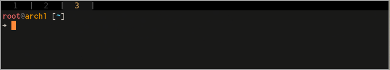

tabbed - generic tabbed interface
=================================
tabbed is a simple tabbed X window container.

### About:
Forked from [suckless/tabbed](https://git.suckless.org/tabbed) w/ patches and modifications.

### Patches:
- alpha
- clientnumber
### Modifications:
- added a separator bar between tabs
- fixed width tabs.
- allow text to be align left, center or right.
### Screenshots:

### Original Readme:
```
tabbed - generic tabbed interface
=================================
tabbed is a simple tabbed X window container.

Requirements
------------
In order to build tabbed you need the Xlib header files.

Installation
------------
Edit config.mk to match your local setup (tabbed is installed into
the /usr/local namespace by default).

Afterwards enter the following command to build and install tabbed
(if necessary as root):

    make clean install

Running tabbed
--------------
See the man page for details.
```
